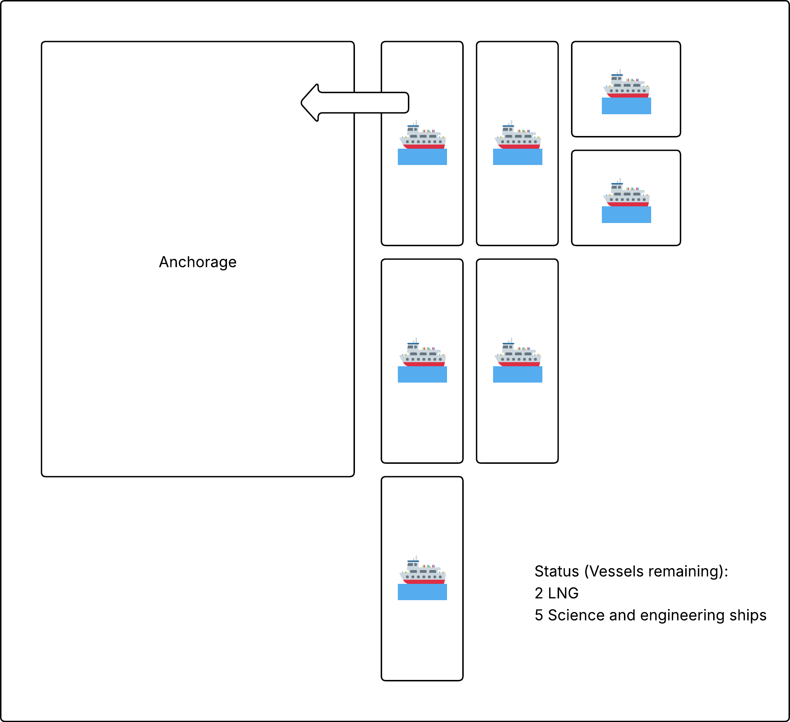
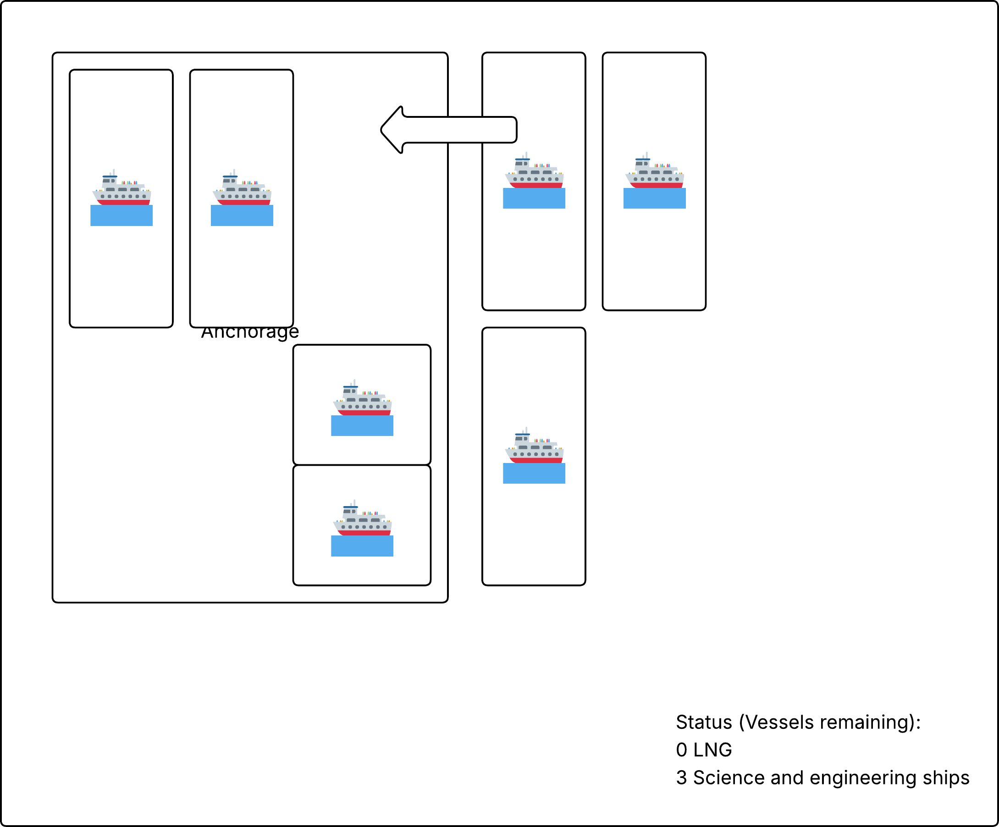
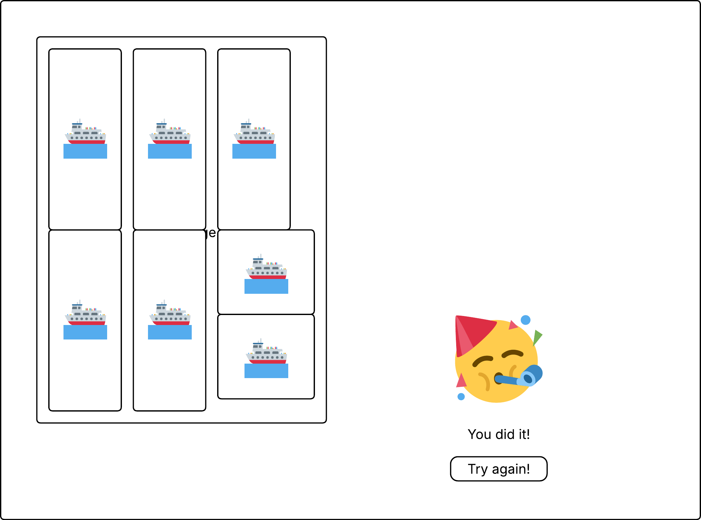

# Frontend Coding Task

## Backstory
One common problem in shipping is to fill an anchorage efficiently with as many vessels as possible. You will create a **Single Page Application** to manually solve this problem (*). The vessels should be placed in the anchorage using **drag and drop**. You will have access to an API which tells you what size the bin is (anchorage) and what items (vessels) to fill in. 

## Prerequisites

- Your favourite IDE to code C# / Blazor 😀
    - .net 9 SDK installed
- github account, we want you to publish your code to a public repository which you share with us. 

## The Task

Create a Blazor WASM or Server app which connects to the api at URL: [https://esa.instech.no/](https://esa.instech.no/).

A request like this:
```sh
$ curl -X GET https://esa.instech.no/api/fleets/random
```
.. can produce a JSON response with data similar to this:
```json
{
  "anchorageSize": {
    "width": 12,
    "height": 15
  },
  "fleets": [
    {
      "singleShipDimensions": { "width": 6, "height": 5 },
      "shipDesignation": "LNG Unit",
      "shipCount": 2
    },
    {
      "singleShipDimensions": { "width": 3, "height": 12 },
      "shipDesignation": "Science & Engineering Ship",
      "shipCount": 5
    }
  ]
}
```

### Suggested UI:



The json states that there are 2 vessels with size (6x5) and 5 vessels with size (3X12). These can be dragged (and dropped) into the anchorage area. 



4 vessels have been placed into the anchorage, 0 (6x5) vessels and 3 (3x12) vessels remaining. 



You are done. 🥳 Clicking the "Try again!" button issues a new request to the API. Based on the response, render a new anchorage and the vessels / items to fill it with. 

### Additional information:
- It could be that the vessels must be possible to rotate 90 degrees to utilize all space in the anchorage. You decide how to do this from a UX perspective (double clicking the vessel maybe?). If this is not possible, leave it. 
- Overlap between vessels is not possible 💥 
- It is ok if the full anchorage cannot be filled, but then you need to provide means to try again, perhaps always show that button? 
- The state of the anchorage does not have to be persisted, page reload will be a new try. 
- Any security concerns are out of scope (auth/CORS ++). 
- You can use third party libraries / components. 

## What will we evaluate?
- Apart from a functional SPA, we want you create a codebase which is "clean" (adhere to the SOLID principles). 
- Are there any parts which can be unit tested? 
  - The UI components are probably not easy to test, but do you have any services, e.g. BinPackService which can be tested with mock dependencies? 
- How do you do state management?
- Apply CSS/Bootstraping to make the SPA look a bit nicer than the wireframes. 
- Documentation - either in code or in a separate readme is highly appreciated. 

Good luck! 🙂  If you have any questions, do not hesitate to contact us.


<small>(*) Fun fact: This is called the binpack problem [Wikipedia](https://en.wikipedia.org/wiki/Bin_packing_problem). </small>

